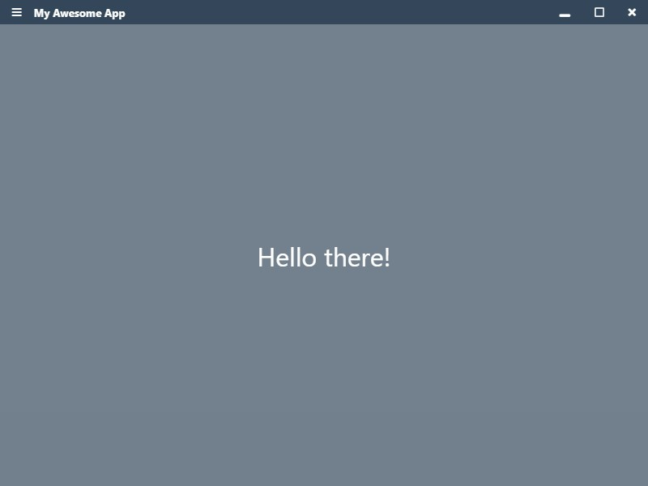
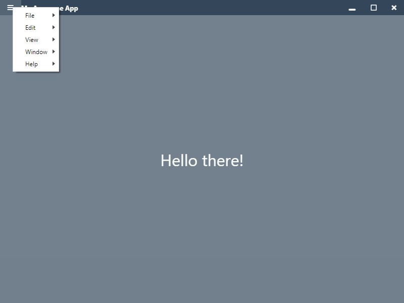
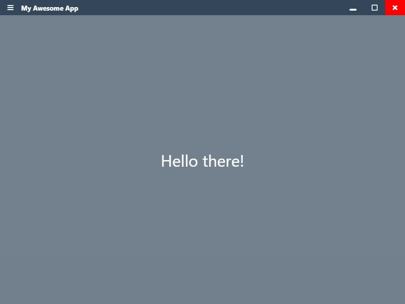

# Creating a custom menu bar in Electron

Do you want to replace your electron app's menu bar to look something cool? Let's see how to build a custom menu bar by building a similar one to slack's menu bar.

## Pre-requisite

Basics of ElectronJS. Check [this tutorial](https://www.electronjs.org/docs/tutorial/first-app) to get started.

## Resources

Finished code is available at [https://github.com/saisandeepvaddi/electron-custom-menu-bar](https://github.com/saisandeepvaddi/electron-custom-menu-bar)

## What we'll build

Here is what it is going to look when we finish.

<p align="center">
  
</p>

<p align="center">
  
</p>

<p align="center">
  
</p>

## Set up electron project

Set up a minimal electron app from electron's official quick start github repo.

```
# Clone the Quick Start repository
$ git clone https://github.com/electron/electron-quick-start

# Go into the repository
$ cd electron-quick-start

# Install the dependencies and run
$ npm install && npm start

```

## Main process code

When you first run `npm start` you will see a window with a default menu bar attached to it. To replace it with our menu bar, we need to do two things. In the `main.js` file we have,

1. Set the `frame: false` in the `options` object for `new BrowserWindow({frame: false, ...other-options})`. This will create a window without toolbars, borders, etc., Check [frameless-window](https://www.electronjs.org/docs/api/frameless-window) for more details.
2. Register an event listener on `ipcMain` which receives a mouse click position when the mouse is clicked on the hamburger icon.

```js
// main.js

  mainWindow = new BrowserWindow({
    width: 800,
    height: 600,
    webPreferences: {
      preload: path.join(__dirname, "preload.js")
      // (NOT RECOMMENDED)
      // If true, we can skip attaching functions from ./menu-functions.js to window object in preload.js.
      // And, instead, we can use electron APIs directly in renderer.js
      // From Electron v5, nodeIntegration is set to false by default. And it is recommended to use preload.js to get access to only required Node.js apis.
      // nodeIntegration: true
    },
    frame: false //Remove frame to hide default menu
  });
  // ...other stuff
}

// Register an event listener. When ipcRenderer sends mouse click co-ordinates, show menu at that position.
ipcMain.on(`display-app-menu`, function(e, args) {
  if (isWindows && mainWindow) {
    menu.popup({
      window: mainWindow,
      x: args.x,
      y: args.y
    });
  }
});

// ... other stuff.
```

Create a file called `menu-functions.js` and define these functions. All the functions here take electron's `BrowserWindow` object (`mainWindow` in this app) and run minimize, maximize, close, open menu actions which we need to trigger from our custom menu bar.

```js
// menu-functions.js
const { remote, ipcRenderer } = require("electron");

function getCurrentWindow() {
  return remote.getCurrentWindow();
}

function openMenu(x, y) {
  ipcRenderer.send(`display-app-menu`, { x, y });
}

function minimizeWindow(browserWindow = getCurrentWindow()) {
  if (browserWindow.minimizable) {
    // browserWindow.isMinimizable() for old electron versions
    browserWindow.minimize();
  }
}

function maximizeWindow(browserWindow = getCurrentWindow()) {
  if (browserWindow.maximizable) {
    // browserWindow.isMaximizable() for old electron versions
    browserWindow.maximize();
  }
}

function unmaximizeWindow(browserWindow = getCurrentWindow()) {
  browserWindow.unmaximize();
}

function maxUnmaxWindow(browserWindow = getCurrentWindow()) {
  if (browserWindow.isMaximized()) {
    browserWindow.unmaximize();
  } else {
    browserWindow.maximize();
  }
}

function closeWindow(browserWindow = getCurrentWindow()) {
  browserWindow.close();
}

function isWindowMaximized(browserWindow = getCurrentWindow()) {
  return browserWindow.isMaximized();
}

module.exports = {
  getCurrentWindow,
  openMenu,
  minimizeWindow,
  maximizeWindow,
  unmaximizeWindow,
  maxUnmaxWindow,
  isWindowMaximized,
  closeWindow
};
```

We need to attach these functions to the `window` object which we can use in the renderer process. If you are using older versions (<5.0.0) of electron or you set `nodeIntegration: true` in `BrowserWindow`'s options, you can use the above `menu-functions.js` file directly in the renderer process. Electron new versions have it `false` set by default for [security reasons](https://www.electronjs.org/docs/tutorial/security#2-do-not-enable-nodejs-integration-for-remote-content).

```js
// preload.js
const { remote } = require("electron");
const {
  getCurrentWindow,
  openMenu,
  minimizeWindow,
  unmaximizeWindow,
  maxUnmaxWindow,
  isWindowMaximized,
  closeWindow
} = require("./menu-functions");

window.addEventListener("DOMContentLoaded", () => {
  window.getCurrentWindow = getCurrentWindow;
  window.openMenu = openMenu;
  window.minimizeWindow = minimizeWindow;
  window.unmaximizeWindow = unmaximizeWindow;
  window.maxUnmaxWindow = maxUnmaxWindow;
  window.isWindowMaximized = isWindowMaximized;
  window.closeWindow = closeWindow;
});
```

We need a menu now. Create a simple menu in a new `menu.js` file. You can learn how to add your own options to the menu at [official docs](https://www.electronjs.org/docs/api/menu). Electron has some easy to follow documentation with examples.

```js
// menu.js

const { app, Menu } = require("electron");

const isMac = process.platform === "darwin";

const template = [
  {
    label: "File",
    submenu: [isMac ? { role: "close" } : { role: "quit" }]
  }
];

const menu = Menu.buildFromTemplate(template);
Menu.setApplicationMenu(menu);

module.exports = {
  menu
};
```

We are done on the main process side. Now, let's build our custom menu bar. If you see the menu in the image, you'll see that we have these things on our menu bar.

1. On the left side, a hamburger icon which is where the menu will open.
2. On the right side, we have minimize button, maximize-unmaximize button, and close button.

I used fontawesome js file from [fontawesome.com](https://fontawesome.com/) for icons. Add it to HTML's `<head>` tag. I removed `Content-Security-Policy` meta tags to allow fontawesome js file to run for now. In production, make sure you properly allow which code should run. Check [CSP](https://developer.mozilla.org/en-US/docs/Web/HTTP/CSP) for more details.

```html
<!-- index.html -->
<!DOCTYPE html>
<html>
 <head>
   <meta charset="UTF-8" />
   <!-- https://developer.mozilla.org/en-US/docs/Web/HTTP/CSP -->

   <title>My Awesome App</title>
   <link rel="stylesheet" href="style.css" />
   <script src="https://kit.fontawesome.com/1c9144b004.js" crossorigin="anonymous"></script>
   </head>
 </head>
 <body>
   <div id="menu-bar">
     <div class="left" role="menu">
       <button class="menubar-btn" id="menu-btn"><i class="fas fa-bars"></i></button>
       <h5>My Awesome App</h5>
     </div>
     <div class="right">
       <button class="menubar-btn" id="minimize-btn"><i class="fas fa-window-minimize"></i></button>
       <button class="menubar-btn" id="max-unmax-btn"><i class="far fa-square"></i></button>
       <button class="menubar-btn" id="close-btn"><i class="fas fa-times"></i></button>
     </div>
   </div>
   <div class="container">
     Hello there!
   </div>

   <!-- You can also require other files to run in this process -->
   <script src="./renderer.js"></script>
 </body>
</html>
```

```css
/* style.css */

body {
  padding: 0;
  margin: 0;
  font-family: "Segoe UI", Tahoma, Geneva, Verdana, sans-serif;
  color: white;
}

#menu-bar {
  display: flex;
  justify-content: space-between;
  align-items: center;
  height: 30px;
  background: #34475a;
  -webkit-app-region: drag;
}

#menu-bar > div {
  height: 100%;
  display: flex;
  justify-content: space-between;
  align-items: center;
}

.menubar-btn {
  -webkit-app-region: no-drag;
}

.container {
  height: calc(100vh - 30px);
  background: #34475ab0;
  color: white;
  display: flex;
  justify-content: center;
  align-items: center;
  font-size: 2em;
}

button {
  height: 100%;
  padding: 0 15px;
  border: none;
  background: transparent;
  outline: none;
}

button:hover {
  background: rgba(221, 221, 221, 0.2);
}

#close-btn:hover {
  background: rgb(255, 0, 0);
}

button i {
  color: white;
}
```

Now your window should look like this. Awesome. We are almost there.

<p align="center">
  
</p>

If you guessed it, none of the buttons in the menu bar work. Because we didn't add `onclick` event listeners for them. Let's do that. Remember we attached some utility functions to the `window` object in `preload.js`? We'll use them in button click listeners.

```js
// renderer.js

window.addEventListener("DOMContentLoaded", () => {
  const menuButton = document.getElementById("menu-btn");
  const minimizeButton = document.getElementById("minimize-btn");
  const maxUnmaxButton = document.getElementById("max-unmax-btn");
  const closeButton = document.getElementById("close-btn");

  menuButton.addEventListener("click", e => {
    // Opens menu at (x,y) coordinates of mouse click on the hamburger icon.
    window.openMenu(e.x, e.y);
  });

  minimizeButton.addEventListener("click", e => {
    window.minimizeWindow();
  });

  maxUnmaxButton.addEventListener("click", e => {
    const icon = maxUnmaxButton.querySelector("i.far");

    window.maxUnmaxWindow();

    // Change the middle maximize-unmaximize icons.
    if (window.isWindowMaximized()) {
      icon.classList.remove("fa-square");
      icon.classList.add("fa-clone");
    } else {
      icon.classList.add("fa-square");
      icon.classList.remove("fa-clone");
    }
  });

  closeButton.addEventListener("click", e => {
    window.closeWindow();
  });
});
```

That's it. Restart your app with `npm run start` and your new menu bar buttons should work.

**NOTE:** Some parts of code are removed in the above scripts for brevity. You can get the full code at [https://github.com/saisandeepvaddi/electron-custom-menu-bar](https://github.com/saisandeepvaddi/electron-custom-menu-bar).

If you want to see a bigger electron app with a lot more stuff, check the [https://github.com/saisandeepvaddi/ten-hands](https://github.com/saisandeepvaddi/ten-hands) app which uses the similar style menu bar (custom style menu bar is visible only on Windows for now though. 😔) but built with React and TypeScript. I wrote this tutorial after using this menu bar there.

Thank you. 🙏
